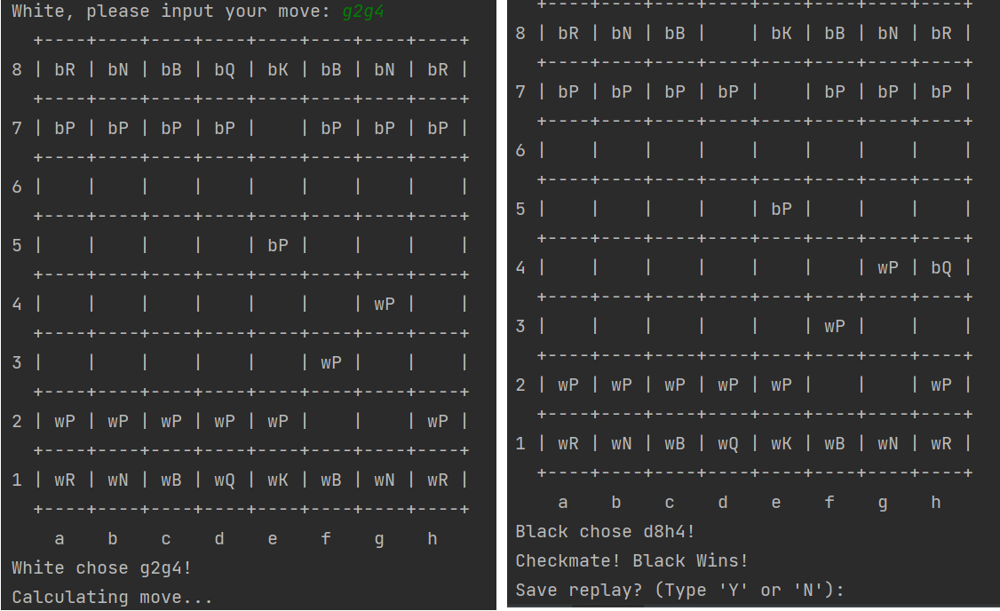

# Chess-Game-AI

Chess text game equipped with an minimax AI.

List of features:
- Local 2 Player Chess (includes all special moves: en passant, castling, pawn promotion)
- Chess vs adjustable difficulty AI
- AI includes endgame adjustments, minimax, alpha-beta pruning, etc.
- Save replay of entire game at the end

# How to Install

1. Download code and unzip

2. Change Directory to downloaded folder directory.

3. Type 'make'

To Run:

1. Type 'cd bin'

2. Type './Chess_vs_AI'

# How to Play

General Instructions:
After installing, run the program and choose to either play Human vs. Human or Human vs. AI.
TO PLAY A MOVE:
First type the letter and number coordinate of the piece you want to move. (coordinates shown on the board)
Then type the letter and number coordinate of where you want the piece to move.

For example:
Typing "a2a4" at the start of the game will move the pawn at "a2" to the empty space at "a4".
Applies to special moves also (last pair of coordinates should still be where you want the piece to go)

Chess moves will be applied.
